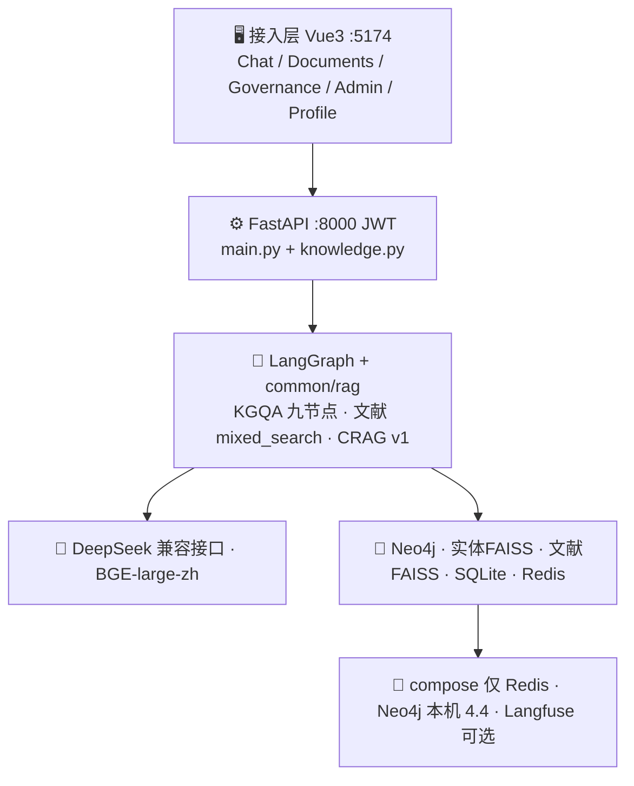

# 草本通 — 中医药知识图谱问答系统

基于大模型 + 知识图谱 + 文献 RAG 的中医智能问答：**自然语言提问 → 指代消解 → 意图路由 → 实体对齐 → Cypher → 文献 CRAG → 可拒答的答案**。覆盖方剂、药材、症状、证候、功效、经络、典籍。

> 前端 Vue 3（**:5174**，避开电网项目 5173）· FastAPI SSE · LangGraph · Neo4j 4.4 · 双 FAISS（实体 / 文献）· SQLite 会话+知识登记 · Redis LTRIM · ContextCompressor（token 预算）· 科室 ACL · 黄金集飞轮 · Langfuse · `obs.degraded`

产品思路对齐电网仓库 **grid-qa** 的分层与完成度，**不抄**电网业务壳（两票、数字孪生、SCADA、Prometheus 全家桶、知识自进化、llm-user-suite）。

**文档**

| 文档 | 读者 |
|---|---|
| 本 README | 开发：架构、配置、API、测试 |
| [`docs/系统架构.md`](docs/系统架构.md) | 代码级 mermaid（函数路径） |
| [`使用手册.md`](使用手册.md) | 使用 / 管理 / 换设备 |

---

## 📑 目录

- [一、项目架构](#一项目架构)
- [二、业务架构](#二业务架构)
- [三、RAG 核心·检索 Retrieval](#三rag-核心检索-retrieval)
- [四、RAG 核心·增强 Augmentation](#四rag-核心增强-augmentation)
- [五、RAG 核心·生成 Generation](#五rag-核心生成-generation)
- [六、横切能力](#六横切能力)
- [七、数据存储职责](#七数据存储职责)
- [八、技术栈](#八技术栈)
- [九、目录结构](#九目录结构)
- [十、快速开始](#十快速开始)
- [十一、配置说明](#十一配置说明)
- [十二、API 接口](#十二api-接口)
- [十三、质量保障与评测](#十三质量保障与评测)
- [十四、换设备与部署](#十四换设备与部署)
- [十五、FAQ](#十五faq)
- [十六、开发进度](#十六开发进度)

---

## 一、项目架构

接入层（Vue）→ 应用层（FastAPI + JWT）→ 引擎层（LangGraph KGQA + 文献 RAG）→ 模型层（OpenAI 兼容 LLM + 本地 BGE）→ 存储层（Neo4j / 双 FAISS / SQLite / Redis）→ 基础设施（本机 Neo4j + compose 仅 Redis）。



详细函数级图见 [`docs/系统架构.md`](docs/系统架构.md)。

---

## 二、业务架构

| 页面 | 路径 | 谁用 |
|---|---|---|
| 问答 | `/chat` | user / admin |
| 知识库 | `/documents` | 上传+浏览；解析/向量化 admin |
| 知识治理 | `/knowledge-governance` | admin |
| 管理 | `/admin` | admin |
| 个人资料 | `/profile` | 改科室、密码 |

主路径：问中医题 → 图谱事实 + 文献块 → 生成。文献弱时图谱仍可答；两者皆空则拒答。点踩可进入黄金集待标注。

角色仅 **user / admin**，不开放自行注册。文档 ACL：空科室=公开。

---

## 三、RAG 核心·检索 Retrieval

两套向量，不要混：

1. **实体 FAISS**（`FAISS_INDEX_PATH`）：口语实体 → 图谱标准名（`entity_normalization`）。
2. **文献 FAISS**（`DOC_FAISS_*`）：知识库切块。`DOC_HYBRID_ENABLE` 时 dense + BM25，`common/rag/rrf.py` 融合，可选 `mmr.py`。

检索后 `knowledge_acl.acl_ok` + `blocked_ids()`（过期治理）过滤。入口：`doc_store.search_documents` ← `doc_retrieval` 节点。

---

## 四、RAG 核心·增强 Augmentation

- **指代消解**：`standalone_query`，多轮「它」→ 独立检索问句。
- **CRAG v1**：`rag/pipeline.py::retrieve_with_crag`，按 top1 分档；incorrect 可 LLM 改写再检索一次，仍差则文献 hits 清空。
- **短期记忆（关键，两条）**：
  - Redis **`LTRIM`**：按**条数**裁热缓存（`REDIS_HISTORY_MAX`）。失败 fail-open 回 SQLite，`degraded("redis*")`。
  - **ContextCompressor**：按 **token** 决定进模型的历史。`token_budget`（默认 2000）+ `fit_budget` 从最新往旧留；溢出旧轮次 LLM 摘要；摘要失败退回 kept，`degraded("context_compress")`。`CONTEXT_COMPRESS=0` 时退回 `GRAPH_HISTORY_LIMIT` 条数截断。
- **证据缺口**：拒答写入 `details.evidence_gap`，管理反馈页可见。不做补全队列。

---

## 五、RAG 核心·生成 Generation

- SSE：`POST /ask/stream`。仅 `answer_generation` / `general_response` 向前端推 `token`。
- `doc_rag.should_refuse`：图谱空且文献不可用 → 固定拒答句。
- 弱证据可加「依据有限，仅供参考。」
- 引用：`common/rag/cite.py` 重叠/相似度闸门（`CITATION_*`）。
- 非中医意图：`general_response`，不跑 Cypher。

---

## 六、横切能力

| 能力 | 实现 |
|---|---|
| 鉴权 | JWT，`deps.py`；登录限流 `login_limit` |
| 降级 | `common/obs.py::degraded`，永不抛；`/health` 与系统运行状态 |
| 追踪 | Langfuse Trace/Span/Generation；失败不影响问答 |
| 评测 | `eval/golden_qa.json` + `scripts/eval_golden.py`；反馈标入黄金集；`eval_manager` 自动评分 |
| 长期记忆 | `_008_memory`：Redis 短期 + 向量三元组 + 画像；失败降级不挡问答 |
| ACL | `knowledge_acl.py` 文档级科室/角色 |
| Prompt | Langfuse 拉取，失败本地 fallback |
| 运行日志 | `common/app_logging.py`：stderr + `data/logs/app.log`（50MB×10）；`/ask` 记 `start/done/error/interrupted` |

---

## 七、数据存储职责

| 存储 | 职责 |
|---|---|
| Neo4j | 方剂/药材/功效/证候等图 |
| 实体 FAISS | 标准实体向量 |
| 文献 FAISS + json | 知识库切块 |
| SQLite | 会话、用户、收藏、`kb_*` 登记与治理 |
| Redis | 近期消息 List，LTRIM 条数 |
| `eval/golden_qa.json` | 黄金集（不放 `data/`，该目录 gitignore） |
| `data/` | 运行时库与上传原件，**不进 git** |

---

## 八、技术栈

| 层 | 技术 |
|---|---|
| 图 | Neo4j 4.4 |
| 向量 | faiss-cpu + sentence-transformers（BGE）+ jieba/BM25 |
| 编排 | LangGraph + LangChain |
| API | FastAPI + Uvicorn SSE |
| 前端 | Vue 3 + Vite + Pinia + Vue Router |
| 会话 | SQLite + Redis |
| 可观测 | Langfuse + 内存 degraded + `data/logs/app.log` |
| Python | conda 环境名 **grid-qa**（不要建 `venv/`） |

遗留：`_006_streamlit`、`_007_fine_tune`（vLLM LoRA）不是主路径。

---

## 九、目录结构

```
_000_demo/                  验证脚本
_001_crawler/               图谱百科爬取 + 知识库公开典籍
_002_extract_information/   抽三元组
_003_create_neo4j_database/ 入库 + 实体 FAISS
_004_langgraph_more_nodes/  图节点（含 doc_retrieval）
_005_fastapi/               main.py + knowledge.py
_006_streamlit/             遗留前端
_007_fine_tune/             LoRA 客户端
_008_memory/                长期记忆（三元组/画像，失败降级）
frontend/                   Vue 主前端 :5174
common/                     会话、压缩器、RAG、知识库、obs、黄金集
corpus/                     演示文献
eval/golden_qa.json         黄金集
docs/系统架构.md            代码级 mermaid
使用手册.md                 操作与换设备
scripts/eval_golden.py
docker-compose.yml          仅 Redis
tests/
```

---

## 十、快速开始

环境：Python 3.10+，Neo4j 4.4（7687），Docker（Redis），Node（前端）。

```bash
docker compose up -d redis          # 6379 被占用则改 REDIS_URL，勿再起
# 启动本机 Neo4j
copy .env.example .env              # 填写密钥与 FAISS/BGE 路径
conda activate grid-qa
pip install -r requirements.txt
npm --prefix frontend install
python -m uvicorn _005_fastapi.main:app --host 127.0.0.1 --port 8000
npm --prefix frontend run dev       # http://localhost:5174
```

默认登录 `admin` / `admin123`。根目录 `.env` 覆盖 `common/.env`。

若本机用仓库 `.deps/`：`PYTHONPATH=<repo>/.deps;<repo>`。`.deps` 不进 git。

---

## 十一、配置说明

完整开关见 `.env.example` 与 [`docs/系统架构.md` 附 A](docs/系统架构.md)。必填：

- 模型：`MODEL_*`
- 图：`NEO4J_*`
- 实体向量：`EMBEDDING_MODEL_PATH`、`FAISS_INDEX_PATH`、`FAISS_METADATA_PATH`
- 登录：把 `JWT_SECRET` 改成长随机串

文献与评测：`DOC_RAG_ENABLE`、`KNOWLEDGE_DOCS_DIR`、`GOLDEN_QA_PATH=eval/golden_qa.json`。

---

## 十二、API 接口

鉴权：除 `/health`、`/auth/login` 外带 `Authorization: Bearer`。

| 方法 | 路径 | 说明 |
|---|---|---|
| GET | `/health` | `status` / `redis` / `degraded` |
| POST | `/auth/login` | 换 JWT |
| POST | `/ask` | 同步问答 |
| POST | `/ask/stream` | SSE：session → progress → token → done |
| CRUD | `/conversations*` `/favorites*` | 会话与收藏 |
| PATCH | `/conversations/.../messages/{id}` | 点赞点踩等 details |
| * | `/document/*` | 知识库 |
| * | `/knowledge-governance/*` | 治理 |
| GET | `/admin/feedbacks` | 反馈 |
| POST | `/admin/feedbacks/{id}/golden` | 标入黄金集 |
| GET | `/admin/import-status` | 系统运行状态数据 |
| GET | `/admin/golden` | 黄金集摘要 |

`/ask` 需登录。curl 示例：

```bash
TOKEN=$(curl -s -X POST http://127.0.0.1:8000/auth/login \
  -H "Content-Type: application/json" \
  -d "{\"username\":\"admin\",\"password\":\"admin123\"}" | python -c "import sys,json; print(json.load(sys.stdin)['token'])")
curl -X POST http://127.0.0.1:8000/ask \
  -H "Authorization: Bearer $TOKEN" \
  -H "Content-Type: application/json" \
  -d "{\"question\":\"四君子汤有什么功效？\"}"
```

---

## 十三、质量保障与评测

```bash
pytest tests/ -q
python scripts/eval_golden.py          # 校验黄金集，不调 LLM
```

黄金集类别：方剂 / 本草 / 证候 / 文献 / 拒答。`source=feedback` 允许空 `expect`（待标注，评分跳过）。通过标准：已标注条目的期望关键词全部出现在答案里。

管理页「评测」只读列表；「反馈 → 标为黄金集」写入 `eval/golden_qa.json`。

---

## 十四、换设备与部署

compose **只起 Redis**。Neo4j、BGE、实体索引在本机。逐步说明见 [`使用手册.md` §9](使用手册.md#9-换设备--给接收方)。

**不会随 git 走的：** `.env`、`data/`（sqlite、上传件、文献索引）、实体 `*.index`。新机要拷或重建。

---

## 十五、FAQ

**为什么前端不是 5173？** 电网 grid-qa 占用 5173。本项目 Vite `strictPort: 5174`。

**为什么 conda 也叫 grid-qa？** 本机约定用项目相关环境名；草本通沿用已有 `grid-qa` 解释器，依赖装进该环境。

**第一次上传为什么没有版本列表？** 首次不归档，只有现行文件。同名再传才写入 `kb_document_versions`。

**LTRIM 和 Compressor 哪个裁历史？** LTRIM 裁 Redis 条数；Compressor 裁进模型的 token。详见架构图 4。

**要不要上 Milvus / MinIO / Prometheus？** 不要为对齐 grid 而搬。当前 FAISS+SQLite 足够本规模。

---

## 十六、开发进度

| 波次 | 内容 | 状态 |
|---|---|---|
| W0/W1 | Vue 多轮 Chat、SQLite+Redis、SSE | 已落地 |
| W2 | ContextCompressor token 预算 | 已落地 |
| W3 | 文献混合检索 + CRAG + 引用 | 已落地 |
| 方案 A | 知识库登记、科室 ACL、治理、版本 | 已落地 |
| W4 | JWT、user/admin | 已落地 |
| W5 | 黄金集、点踩回流、degraded、系统运行状态 | 已落地 |

有意未做：知识自进化、llm-user-suite、四角色、HotQA、CRAG LLM-per-doc、K8s。

---

## 📝 License

MIT
