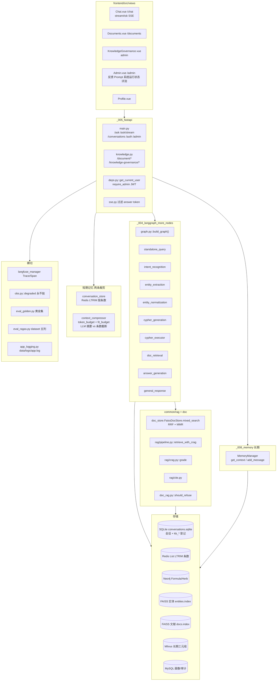
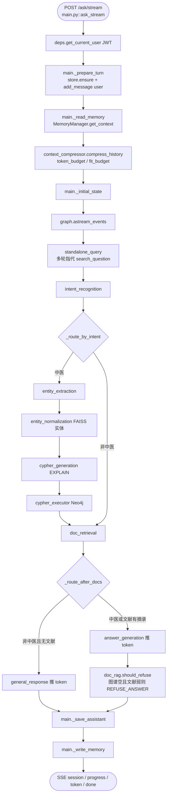
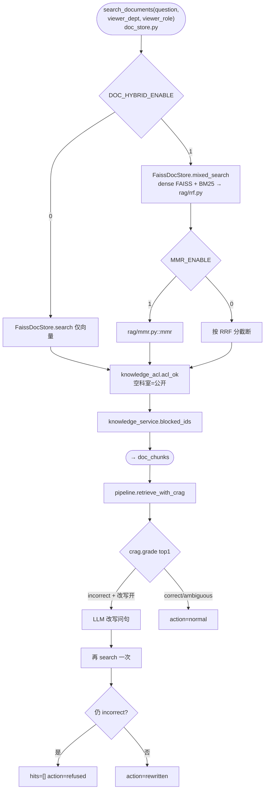
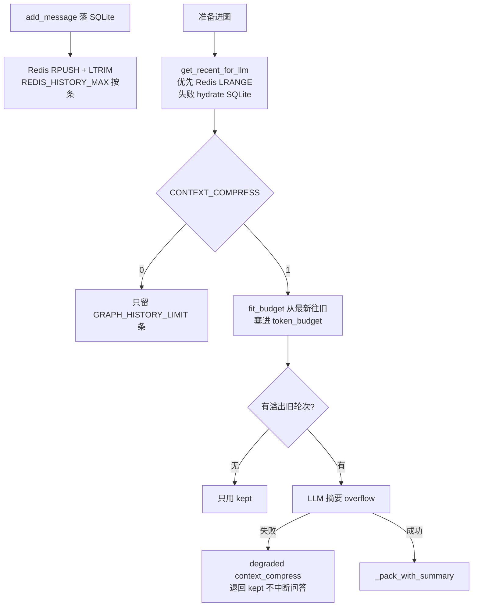
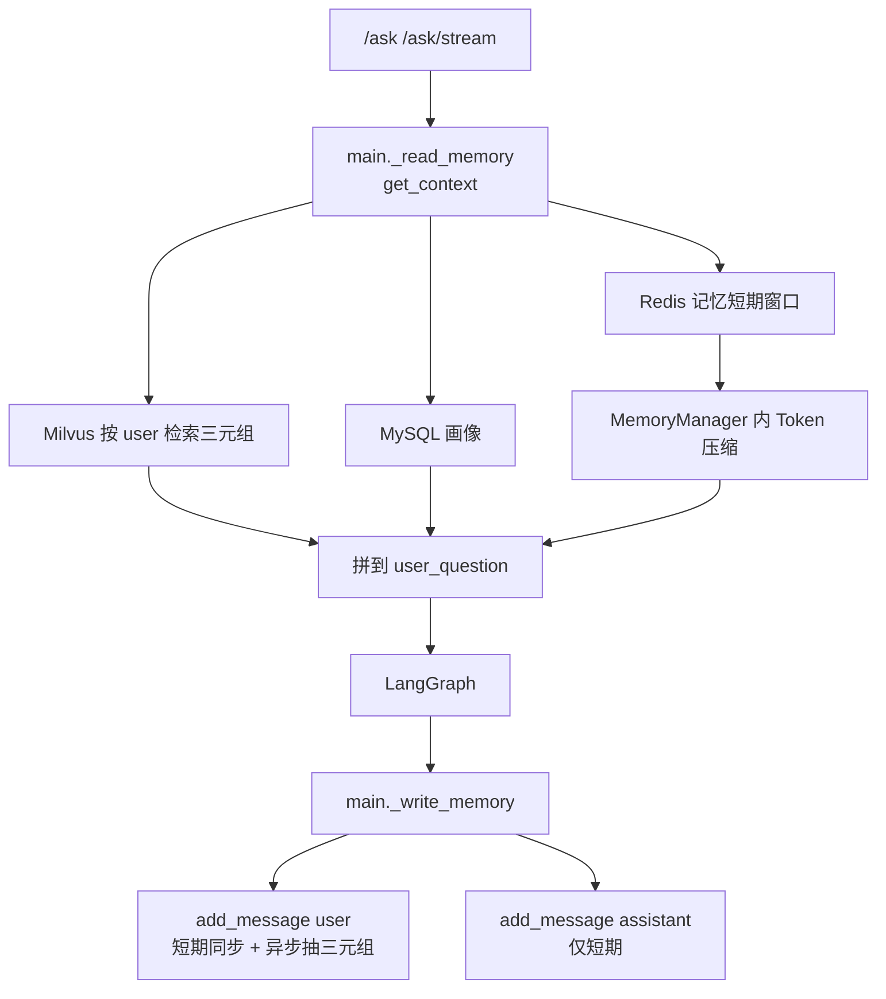
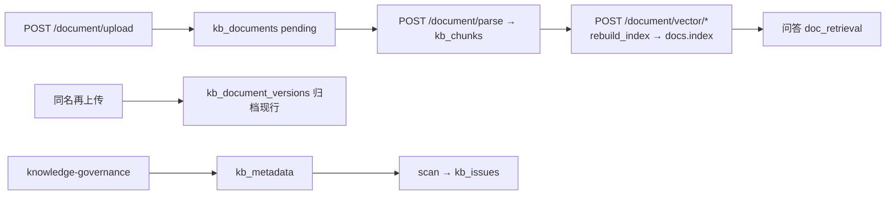
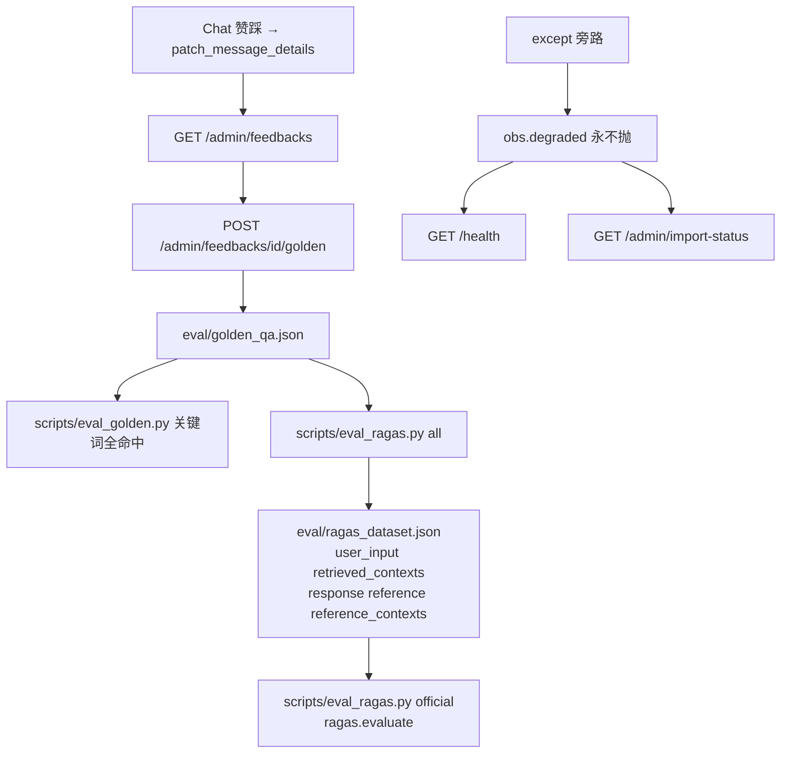

# 草本通 · 架构总览（代码级 mermaid）

> **仓库**：chinese_medical  
> **技术栈**：Vue3(:5174) + FastAPI(:8000) + SQLite + Redis + Neo4j 4.4 + 双 FAISS（实体 / 文献）+ LangGraph + Langfuse + 可选 Milvus/MySQL 长期记忆  
> 节点命名约定：`文件.py::函数()` / 表名 / 开关名  
> 产品思路对齐 grid-qa；**不抄**电网壳（两票、孪生、SCADA、Prometheus 全家桶、知识自进化）。

---

## 图 1 · 系统总览（分层 + 主数据流）

---

## 图 2 · 问答链路（流式，函数级）

与 [`_004_langgraph_more_nodes/graph.py`](../_004_langgraph_more_nodes/graph.py) 一致：非中医**先文献检索**，有摘录才走 `answer_generation`。

SSE：`session`（conversation_id）→ `progress`（图节点中文名）→ `token`（仅 `answer_generation` / `general_response`，由 `sse.py` 过滤）→ `done`。Vite 代理关掉 SSE 缓冲。

---

## 图 3 · 文献检索引擎 mixed_search

实体 FAISS（口语→标准名）与文献 FAISS（知识库块）是**两套文件**。

图谱事实仍可单独作答：文献 CRAG 拒答不等于整题拒答；`doc_rag.should_refuse` 要求图谱也空。

---

## 图 4 · 短期记忆：LTRIM 条数 vs ContextCompressor token

问答主路径用 [`common/conversation_store.py`](../common/conversation_store.py) + [`common/context_compressor.py`](../common/context_compressor.py)。**不要**和 `_008_memory` 里那套拼 Prompt 的 Compressor 混成一件事。

- **LTRIM**：热缓存条数硬顶（`REDIS_HISTORY_MAX`，默认 50），不管 token。失败 fail-open 回 SQLite。
- **ContextCompressor（问答）**：决定塞进 LangGraph 的历史有多长。`token_budget` 默认 2000（`TOKEN_BUDGET`）+ `fit_budget` 从最新往旧留；放不下则旧轮次 LLM 摘要。`CONTEXT_COMPRESS=0` 时退回 `GRAPH_HISTORY_LIMIT` 条数截断。系统提示、图谱结果、当前问句不计入该预算。
- LTRIM 不管 token；Compressor 不管 Redis 列表长度。

---

## 图 4b · 长期记忆（`_008_memory`，失败不挡问答）

与会话 Redis List **不是同一条键**。短期键：`mem:short:{user_id}:{session_id}`。

| 层 | 存什么 | 后端 | 隔离 |
|---|---|---|---|
| 短期（记忆子系统） | 本会话刚说了什么 | Redis List + LTRIM + TTL | user + session |
| 长期 | 跨会话稳定事实 | Milvus 三元组；失败 `data/memory/long_term.json` | user |
| 画像 | 结构化偏好 | MySQL `agent_user_profile`；失败 JSON | user |
| 审计 | 变更预览 | MySQL `agent_memory_audit` | user |

问答图用的历史窗口仍是 `conversation_store` 那条 Redis List（会话消息），不要把两套短期记成一个开关。

---

## 图 5 · 知识库登记（SQLite kb_*）

会话库与知识库共用 `CONVERSATION_DB_PATH`（默认 `data/conversations.sqlite`）。

第一次上传没有版本行；空 `kb_document_versions` 不代表没文档。

---

## 图 6 · 评测飞轮 + 降级打点

`corpus/` 五篇从 `data/kb_crawl` 公版原文按段摘录（繁体为主；`expect` 必须同字）。`all` 填满五列；`official` 才调 ragas 包（`requirements-eval.txt`，钉住 langgraph）。抽取式 Faithfulness 会偏高。

---

## 附 A · 配置开关速查（`.env`）

| 域 | 关键开关（默认） |
|---|---|
| 模型 | 默认 `MODEL_*`；聊天下拉 `model_type`。只切问答图；ContextCompressor 与 Redis LTRIM、长期记忆、评测仍用 `MODEL_*` |
| 图 | `NEO4J_URI` · `NEO4J_USER` · `NEO4J_PASSWORD` |
| 实体向量 | `EMBEDDING_MODEL_PATH` · `FAISS_INDEX_PATH` · `FAISS_METADATA_PATH` |
| 会话 | `REDIS_URL` · `CONVERSATION_DB_PATH` · `REDIS_HISTORY_MAX=50` |
| 记忆（问答压缩） | `TOKEN_BUDGET=2000` · `GRAPH_HISTORY_LIMIT=6` · `CONTEXT_COMPRESS` |
| 记忆（长期） | `MILVUS_*` · `MYSQL_*` · `MEMORY_SHORT_ROUNDS` |
| 文献 RAG | `DOC_RAG_ENABLE=1` · `DOC_HYBRID_ENABLE=1` · `MMR_ENABLE=1` · `CRAG_ENABLE=1` |
| CRAG | `CRAG_HIGH=0.72` · `CRAG_LOW=0.3` · `CRAG_REWRITE_ENABLE=1` |
| 知识库 | `KNOWLEDGE_DOCS_DIR=data/docs` · `DOC_UPLOAD_MAX_BYTES` |
| 评测 | `GOLDEN_QA_PATH` · `RAGAS_TESTSET_PATH` · `RAGAS_DATASET_PATH` · `RAGAS_REPORT_PATH` |
| 登录 | `JWT_SECRET` · `ADMIN_USERNAME` / `ADMIN_PASSWORD` |
| Langfuse | `LANGFUSE_ENABLED` · `LANGFUSE_HOST` · keys |
| 运行日志 | `LOG_DIR=data/logs`（`TESTING=1` 不写盘） |

---

## 附 B · 端口与部署

| 项 | 值 |
|---|---|
| 前端 Vite | **5174**（strictPort；电网项目占 5173）。请用 `http://localhost:5174`（Vite 绑 `::1`） |
| FastAPI | 8000 · `/api` 由 Vite 反代 |
| Neo4j | 本机 7687（不进 compose） |
| Redis | 6379（`docker compose up -d redis`） |
| Langfuse | 3000（可选） |
| 默认账号 | admin / admin123 |
| Python | conda 环境名 **`grid-qa`**（本机亦可用 `ctm_kg`），不要在仓库建 `venv/` |

---

## 附 C · 闭环总览

> **防胡编**：非中医先检索文献，无摘录才 `general_response`；图谱空 + 文献 CRAG incorrect → `REFUSE_ANSWER`。  
> **记忆**：会话 Redis LTRIM 管条数；`common/context_compressor` 管进图 token；`_008_memory` 管跨会话事实，失败不挡问答。  
> **回流**：点踩 → 黄金集关键词；文献 RAG 另写 `eval/ragas_dataset.json` 五列。  
> **韧性**：依赖失败 `degraded(tag)`，用户侧 fail-open。

**顶层**：JWT 管身份，LangGraph 管图谱问答，`common/rag` 管文献质量，SQLite 管会话与知识登记，obs/Langfuse 管可见性。
