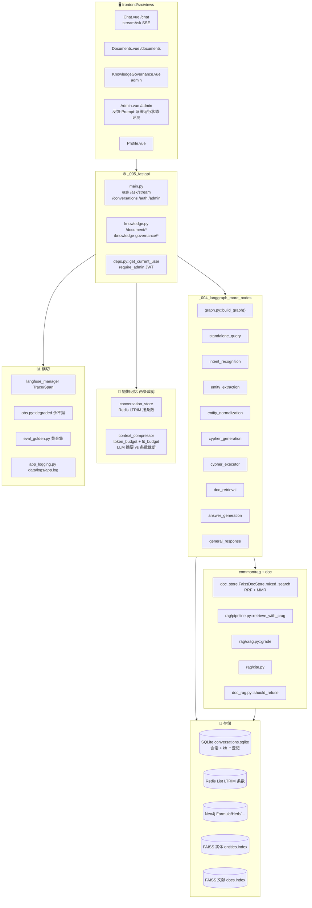
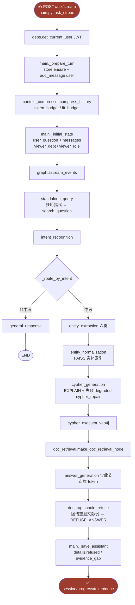
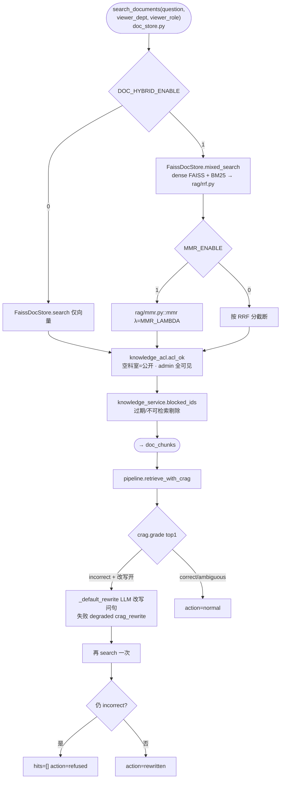
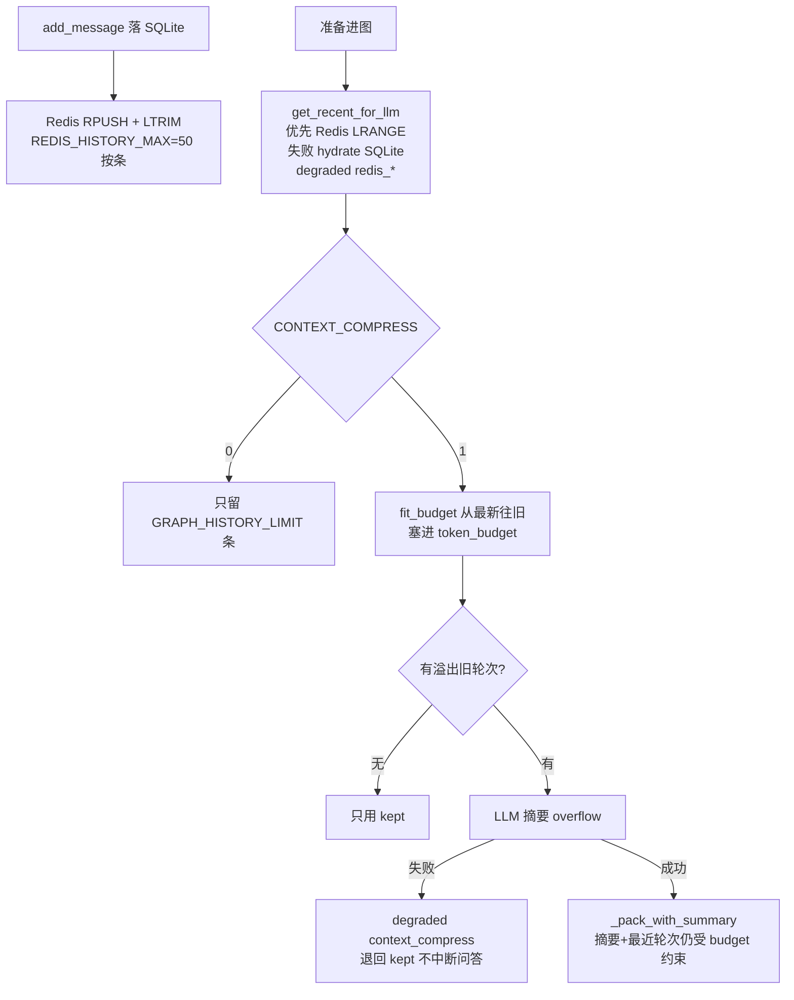
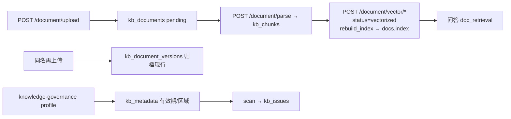
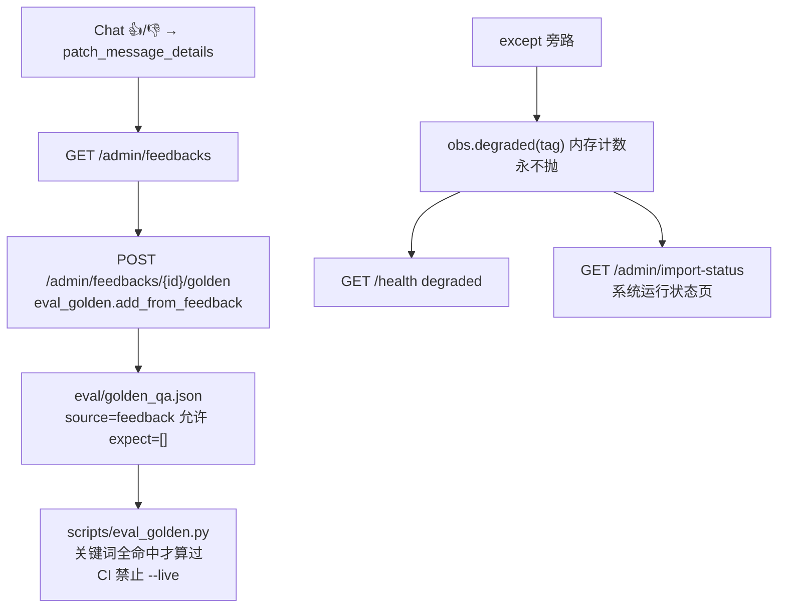

# 草本通 · 架构总览（代码级 mermaid）

> **版本**：`7b1da4f` 后补文档，2026-09-12 ｜ **仓库**：chinese_medical  
> **技术栈**：Vue3(:5174) + FastAPI(:8000) + SQLite + Redis + Neo4j 4.4 + 双 FAISS（实体 / 文献）+ LangGraph + Langfuse  
> 节点命名约定：`文件.py::函数()` / 表名 / 开关名  
> 产品思路对齐 grid-qa；**不抄**电网壳（两票、孪生、SCADA、Prometheus 全家桶、知识自进化）。

---

## 图 1 · 系统总览（分层 + 主数据流）

---

## 图 2 · 问答链路（流式，函数级）

SSE：`session`（conversation_id）→ `progress`（图节点中文名）→ `token`（仅 `answer_generation` / `general_response`）→ `done`。

---

## 图 3 · 文献检索引擎 mixed_search

实体 FAISS（口语→标准名）与文献 FAISS（知识库块）是**两套文件**。

图谱事实仍可单独作答：文献 CRAG 拒答不等于整题拒答；`doc_rag.should_refuse` 要求图谱也空。

---

## 图 4 · 短期记忆：LTRIM 条数 vs ContextCompressor token

- **LTRIM**：热缓存条数硬顶，不管 token。  
- **Compressor**：决定塞进模型的历史有多长。`token_budget` 默认 2000（系统提示、图谱结果、当前问句另算）。

---

## 图 5 · 知识库登记（SQLite kb_*）

会话库与知识库共用 `CONVERSATION_DB_PATH`（默认 `data/conversations.sqlite`）。

**第一次上传没有版本行**；版本弹窗应展示「现行 vN」。空 `kb_document_versions` 不代表没文档。

---

## 图 6 · 评测飞轮 + 降级打点

不是旁路评测子系统，没有知识自进化、没有 llm-user-suite。

---

## 附 A · 配置开关速查（`.env`）

| 域 | 关键开关（默认） |
|---|---|
| 模型 | 默认 `MODEL_*`；聊天下拉 `model_type`：`DEEPSEEK_*` / `QWEN_*`·`DASHSCOPE_*` / `DOUBAO_*`·`ARK_*`。只切问答图；ContextCompressor（`TOKEN_BUDGET` / `fit_budget`，超预算 LLM 摘要）与 Redis `LTRIM` 条数裁剪、长期记忆、评测仍用 `MODEL_*` |
| 图 | `NEO4J_URI` · `NEO4J_USER` · `NEO4J_PASSWORD` |
| 实体向量 | `EMBEDDING_MODEL_PATH` · `FAISS_INDEX_PATH` · `FAISS_METADATA_PATH` |
| 会话 | `REDIS_URL` · `CONVERSATION_DB_PATH` · `REDIS_HISTORY_MAX=50` |
| 记忆 | `TOKEN_BUDGET=2000` · `GRAPH_HISTORY_LIMIT=6` · `CONTEXT_COMPRESS` |
| 文献 RAG | `DOC_RAG_ENABLE=1` · `DOC_HYBRID_ENABLE=1` · `MMR_ENABLE=1` · `CRAG_ENABLE=1` |
| CRAG | `CRAG_HIGH=0.72` · `CRAG_LOW=0.3` · `CRAG_REWRITE_ENABLE=1` |
| 知识库 | `KNOWLEDGE_DOCS_DIR=data/docs` · `DOC_UPLOAD_MAX_BYTES` |
| 评测 | `GOLDEN_QA_PATH=eval/golden_qa.json` |
| 登录 | `JWT_SECRET` · `ADMIN_USERNAME` / `ADMIN_PASSWORD` |
| Langfuse | `LANGFUSE_ENABLED` · `LANGFUSE_HOST` · keys |
| 运行日志 | `LOG_DIR=data/logs`（50MB×10；`TESTING=1` 不写盘） |

---

## 附 B · 端口与部署

| 项 | 值 |
|---|---|
| 前端 Vite | **5174**（strictPort；电网项目占 5173） |
| FastAPI | 8000 · `/api` 由 Vite 反代 |
| Neo4j | 本机 7687（不进本仓库 compose） |
| Redis | 6379（`docker compose up -d redis`） |
| Langfuse | 3000（可选） |
| 默认账号 | admin / admin123 |
| Python | conda 环境名 **`grid-qa`**，不要在仓库建 `venv/` |

---

## 附 C · 闭环总览

> **防胡编**：意图非中医走 `general_response`；图谱空 + 文献 CRAG incorrect → `REFUSE_ANSWER`。  
> **记忆**：Redis 管条数，Compressor 管 token。  
> **回流**：点踩 → 标为黄金集 → 离线关键词命中。  
> **韧性**：依赖失败 `degraded(tag)`，用户侧 fail-open。

**顶层**：网关 JWT 管身份，LangGraph 管图谱问答，`common/rag` 管文献质量，SQLite 管会话与知识登记，obs/Langfuse 管可见性。
